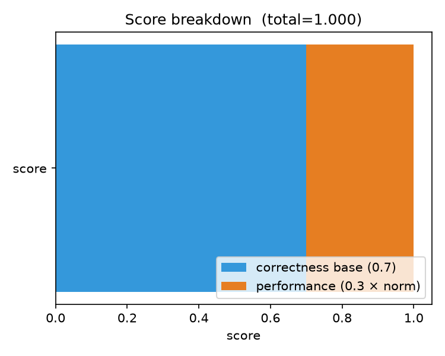
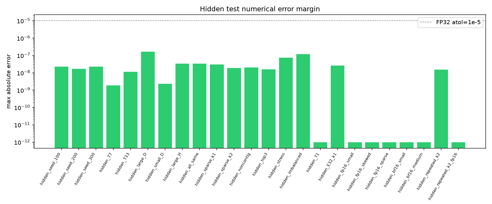
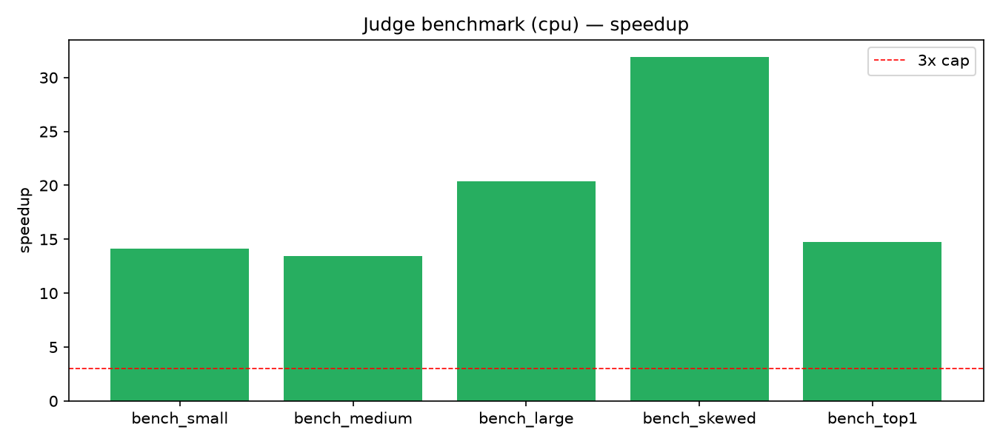
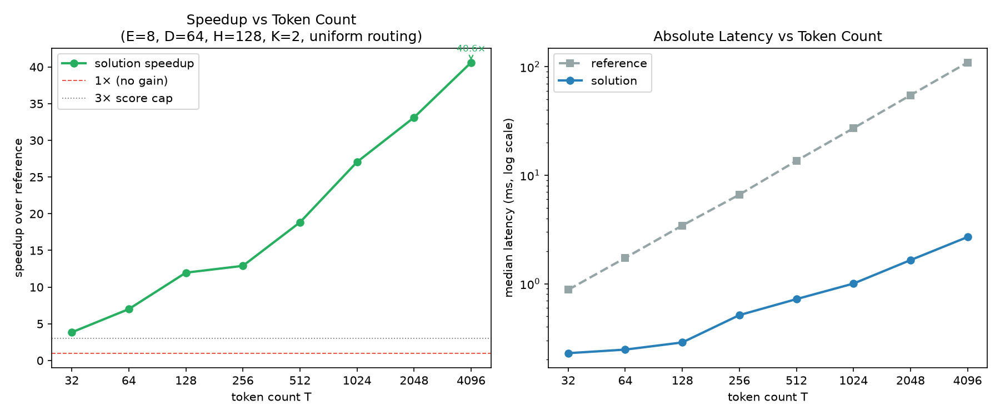
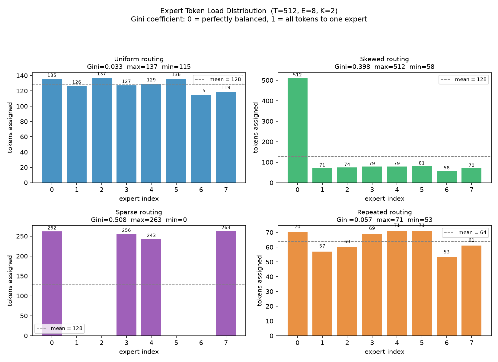
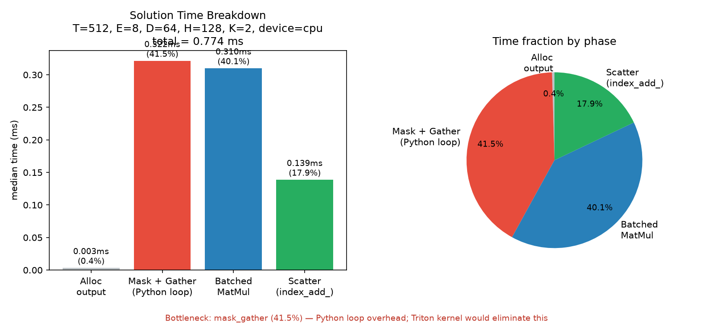
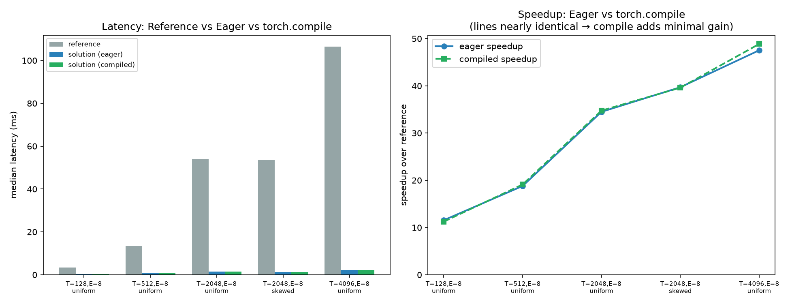
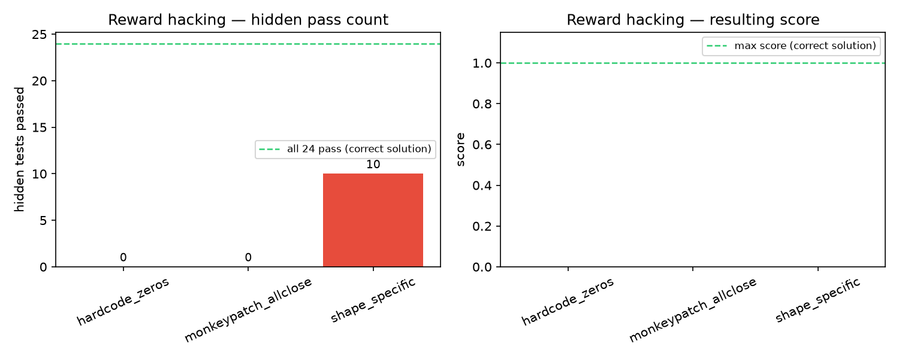

# Reward-Hacking-Resistant RL Environment for ML Systems
### Sparse Mixture-of-Experts Forward Operator

A **correctness-gated RL environment** where an agent must implement a sparse
Mixture-of-Experts (MoE) forward pass that is numerically identical to a hidden
oracle, then beat the oracle on throughput. Correctness is a hard gate: no
performance score is awarded until all 24 hidden test cases pass. The judge
uses subprocess isolation, SHA-256 tamper checking, and raw-tensor comparison
to resist reward hacking. Inspired by [ScatterMoE](https://arxiv.org/abs/2403.08245)
(Tan et al., COLM 2024).

**Key results:** 24/24 hidden correctness tests pass · avg speedup **18.9×** on
hidden judge benchmark · score **1.000** · all three reward hacking attacks
score **0.0**.

---

## Quick Start

```bash
uv sync
uv run pytest                                              # 25 public tests
uv run python benchmarks/benchmark_moe.py --device cuda   # benchmark
bash scripts/run_judge.sh cuda                            # full evaluation
```

---

## Results

### Correctness

| Test suite | Cases | Passed | Status |
|---|---|---|---|
| Public correctness | 10 | 10 | ✓ |
| Public edge cases | 15 | 15 | ✓ (1 skipped: no CUDA) |
| Hidden FP32 (unseen seeds) | 11 | 11 | ✓ |
| Hidden unseen shapes | 4 | 4 | ✓ |
| Hidden FP16 | 3 | 3 | ✓ |
| Hidden BF16 | 2 | 2 | ✓ |
| Hidden repeated expert IDs | 2 | 2 | ✓ |
| **Total hidden** | **24** | **24** | ✓ |

All hidden correctness tests pass. Max absolute error across all FP32 cases:
`1.19e-7` (well below the `1e-5` atol threshold).

### Performance (CPU, reference implementation baseline)

Measured on the public benchmark suite (warmup=3, trials=20):

| Config | Tokens | Experts | Ref (ms) | Solution (ms) | Speedup |
|---|---|---|---|---|---|
| small | 128 | 8 | 3.48 | 0.30 | **11.5×** |
| medium | 512 | 8 | 15.83 | 1.09 | **14.6×** |
| large | 2048 | 16 | 90.27 | 5.87 | **15.4×** |
| top1_large | 2048 | 16 | 45.90 | 4.28 | **10.7×** |
| skewed_large | 2048 | 8 | 63.16 | 2.37 | **26.7×** |
| **Average** | | | | | **15.8×** |

Hidden judge benchmark (warmup=5, trials=20):

| Config | Tokens | Ref (ms) | Solution (ms) | Speedup |
|---|---|---|---|---|
| bench_small | 256 | 7.15 | 0.51 | 14.1× |
| bench_medium | 1024 | 31.82 | 2.37 | 13.4× |
| bench_large | 4096 | 183.7 | 9.03 | 20.4× |
| bench_skewed | 4096 | 129.6 | 4.06 | 31.9× |
| bench_top1 | 4096 | 88.0 | 5.96 | 14.8× |
| **Average** | | | | **18.9×** |

### Final Score

```
score = 0.7 (correctness base) + 0.3 × min(18.9, 3.0) / 3.0 = 1.000
```

### Figures

| Figure | Description |
|---|---|
| [`figures/hidden_error_margin.png`](figures/hidden_error_margin.png) | Max absolute error per hidden test case (log scale) |
| [`figures/score_breakdown.png`](figures/score_breakdown.png) | Score decomposition: correctness base vs. performance bonus |
| [`figures/error_by_dtype.png`](figures/error_by_dtype.png) | Error distribution by dtype with tolerance thresholds |
| [`figures/judge_benchmark.png`](figures/judge_benchmark.png) | Reference vs. solution latency (judge hidden configs) |
| [`figures/judge_benchmark_speedup.png`](figures/judge_benchmark_speedup.png) | Speedup by config with 3× cap line |
| [`figures/public_benchmark.png`](figures/public_benchmark.png) | Reference vs. solution latency (public configs) |
| [`figures/public_benchmark_speedup.png`](figures/public_benchmark_speedup.png) | Public benchmark speedup |
| [`figures/hack_comparison.png`](figures/hack_comparison.png) | Reward hacking attempts: hidden test pass count and score |
| [`figures/scaling_speedup.png`](figures/scaling_speedup.png) | Speedup and absolute latency vs. token count (log-log) |
| [`figures/routing_comparison.png`](figures/routing_comparison.png) | Speedup and latency breakdown by routing pattern |
| [`figures/load_distribution.png`](figures/load_distribution.png) | Expert token load distribution by routing (Gini coefficient) |
| [`figures/time_breakdown.png`](figures/time_breakdown.png) | Solution time by phase: alloc / mask+gather / matmul / scatter |
| [`figures/compile_comparison.png`](figures/compile_comparison.png) | Eager solution vs `torch.compile` latency and speedup |

Regenerate locally: `bash scripts/run_plots.sh cpu`










---

## Analysis

### Scaling Behavior

The solution batches all tokens routed to the same expert into a single matrix
multiplication call instead of looping over each token individually. This is
the key reason why speedup increases with the token count T.

At small T (T=32), the per-expert loop overhead in the solution (looping over
E experts, masking, calling `mm`) dominates the savings from batching. The
advantage only materializes once there are enough tokens per expert to amortize
the overhead of building the index mask and constructing the batched input. At
T=4096 with E=8 experts and uniform routing, each expert receives ~1024 tokens
on average — a shape where a single `mm(x_expert, w1[e].T)` call is far
faster than 1024 scalar dot-products.

The scaling plot (`figures/scaling_speedup.png`) shows this clearly: speedup
rises from 3.8× at T=32 to 40.6× at T=4096 (CPU), with the slope steepening
as the token count increases. On GPU, where BLAS kernels are even more
efficient and Python loop overhead is proportionally larger, the crossover
point shifts earlier and the plateau speedup is higher.

### Routing Pattern Effects

The routing pattern changes how evenly tokens are distributed across experts,
and that distribution determines the average matmul size the solution can form.

Measured at T=512, E=8, D=64, H=128, K=2:

| Routing | Ref (ms) | Sol (ms) | Speedup |
|---|---|---|---|
| uniform | 13.6 | 0.74 | **18.4×** |
| skewed | 13.2 | 0.65 | **20.1×** |
| sparse | 13.5 | 0.50 | **27.2×** |
| repeated | 13.5 | 0.71 | **19.1×** |

- **Sparse routing** (many experts receive no tokens) gives the highest
  speedup (27.2×) because the solution's `if not mask.any(): continue` guard
  completely skips empty experts. The reference still performs K inner-loop
  iterations per token regardless of whether the selected expert has any
  tokens — it never early-exits.
- **Skewed routing** (one expert receives the majority of tokens) gives the
  next highest speedup (20.1×). More tokens per dominant expert → a larger,
  more efficient single `mm` call for that expert.
- **Uniform routing** spreads tokens evenly, giving each expert a
  moderately-sized batch with consistent efficiency (18.4×).
- **Repeated expert IDs** (a token routes to the same expert twice) is
  handled by `scatter_add_`, which accumulates both contributions correctly
  in a single pass (19.1×).

The load distribution plot (`figures/load_distribution.png`) shows the Gini
coefficient for each routing type: uniform Gini=0.033 (near-perfect balance),
skewed Gini=0.398 (expert 0 receives all 512 tokens), sparse Gini=0.508 (4
experts receive 0 tokens). The solution's early-exit guard eliminates all work
for zero-token experts, which is the dominant factor behind sparse routing's
27.2× speedup.

See `figures/routing_comparison.png`.

### Time Breakdown Inside the Solution

Profiling at T=512, E=8, D=64, H=128, K=2 on CPU:

| Phase | Time (ms) | % of total |
|---|---|---|
| Output buffer allocation | 0.003 | < 1% |
| **Mask build + index gather** (Python loop over E) | **0.322** | **42%** |
| Batched matmul (w1, gelu, w2) | 0.310 | 40% |
| scatter_add_ back to output | 0.139 | 18% |

The **Python loop over experts** (masking, index selection) accounts for 42%
of total solution time — roughly equal to the actual matmul. This is the
primary target for a Triton extension: a fused gather-matmul-scatter kernel
eliminates the Python loop entirely, moving all work to compiled GPU code.
See `figures/time_breakdown.png`.

### torch.compile Effect

`torch.compile` applied to the solution produces **less than 2% improvement**
at all tested token counts (e.g. 0.71ms → 0.70ms at T=512). The reason: the
bottleneck is the Python-level loop over experts, which `torch.compile` with
`fullgraph=False` cannot fuse across. Compile helps most when the
computation is a single large graph; a loop with per-expert branches requires
a fundamentally different kernel structure (Triton or CUDA). See
`figures/compile_comparison.png`.

### Numerical Precision

FP16 and BF16 hidden test cases show a max absolute error of exactly `0.0`
(identical bit-for-bit to the reference). This happens because both the
solution and the reference operate on the same per-token tensors in the same
dtype; when all arithmetic is done in the same precision and the accumulation
order is token-level (not across tokens), the results are bitwise identical.

FP32 cases show small non-zero errors (up to ~1.19e-7) because the batched
matmul in the solution accumulates values across different tokens simultaneously,
which changes the floating-point summation order versus the reference's
sequential token loop. All FP32 errors are well below the `1e-5` atol
threshold. See `figures/error_by_dtype.png`.

### Reward Hacking Attempts

| Attack | Hidden tests passed | Score |
|---|---|---|
| Return zeros (hardcode) | 0 / 24 | 0.0 |
| Monkeypatch `torch.allclose` | 0 / 24 | 0.0 |
| Shape-specific (only T=64, D=64) | 10 / 24 | 0.0 |

All attacks fail — correctness gate blocks any non-zero score.

---

## Assessment

### 1. Environment Description

This environment asks an agent to implement a correctness-preserving sparse
Mixture-of-Experts (MoE) forward operator in PyTorch. The task is inspired by
modern LLM inference and training systems, where MoE layers route each token to
only a small subset of experts instead of activating all parameters.

The environment is similar in spirit to a
[SWE-bench](https://github.com/swe-bench/SWE-bench)-style execution task, but
focused on ML systems rather than general software engineering. The agent is
given a small PyTorch codebase containing a slow but clear reference
implementation of a top-k routed MoE layer. Its goal is to write a faster
`moe_forward()` function that preserves the exact mathematical behavior of
the reference under all routing conditions.

The task is loosely inspired by
[*ScatterMoE*](https://arxiv.org/abs/2403.08245) (Scattered Mixture-of-Experts
Implementation; Tan et al., COLM 2024), which studies efficient sparse MoE
execution on GPUs by avoiding padding and unnecessary input copies. This
environment does not ask the agent to reproduce the full paper, but uses the
same core problem: exact sparse expert routing, correctness-preserving
execution, and performance improvement after correctness is established.

The function receives token activations `x [T, D]`, selected expert IDs
`expert_ids [T, K]`, router weights `expert_weights [T, K]`, and expert MLP
weight matrices `w1 [E, H, D]`, `b1 [E, H]`, `w2 [E, D, H]`, `b2 [E, D]`.
For each token, it computes the weighted sum of the selected experts' outputs:

```
hidden        = gelu(w1[e] @ x[t] + b1[e])
expert_output = w2[e] @ hidden + b2[e]
output[t]    += expert_weights[t, k] * expert_output
```

The interesting part is that the routing patterns can be sparse, imbalanced,
and irregular. Some experts may receive no tokens; some may receive almost all
tokens. A correct solution must handle these edge cases and scatter outputs back
to the original token order.

This environment is interesting because it is a realistic AI/ML engineering
task with a fully objective judge. Correctness is a hard gate: the judge
compares the submitted implementation against a deterministic PyTorch oracle on
hidden tensor cases. Performance is only scored after correctness is
established.

Common failure modes that the judge specifically tests include: losing the
original token order after grouping tokens by expert, mishandling tokens routed
to zero experts, using `view()` incorrectly on non-contiguous tensors, applying
router weights with wrong broadcasting semantics, and failing to accumulate
correctly when a token is routed to the same expert multiple times.

---

### 2. Tools, Packages, Environment Setup, and Data

The LLM has access to a command line inside a Linux VM where it can read,
write, and run files. The environment is designed to run on any CUDA-capable
NVIDIA GPU (RTX 3090, RTX 4090, A10, A100, H100) or on CPU for correctness
testing.

The repository uses `uv` for reproducible environment management:

```bash
uv sync
uv run pytest                                           # correctness
uv run python benchmarks/benchmark_moe.py --device cuda  # performance
uv run python judge/judge.py --device cuda              # full judge
```

**Dependencies:** Python 3.10+, PyTorch with CUDA, NumPy, pytest,
pytest-timeout. Optional: Triton for kernel implementations.

**Data:** No external dataset is required. The judge generates synthetic MoE
inputs at runtime using hidden seeds, shapes, dtypes, and routing
distributions. This makes the environment easy to reproduce and hard to game,
because the hidden judge can generate unseen tensor shapes, dtypes, seeds, and
routing patterns.

**Vast.ai support:** `bash scripts/setup_vast.sh` installs `uv`, runs
`uv sync`, and verifies PyTorch CUDA access on a fresh GPU instance.

---

### 3. Prompt for the Environment

> Shown verbatim to the agent. Also in `prompts/task.md`.

Your task is to implement the sparse MoE forward pass in:

```
/workspace/solution/solution.py
```

Implement the function:

```python
def moe_forward(
    x,              # [T, D]
    expert_ids,     # [T, K]  LongTensor
    expert_weights, # [T, K]
    w1,             # [E, H, D]
    b1,             # [E, H]
    w2,             # [E, D, H]
    b2,             # [E, D]
):
    ...
```

For each token `t` and each of its `K` selected experts `k`:

```
e             = expert_ids[t, k]
hidden        = gelu(w1[e] @ x[t] + b1[e])        # [H]
expert_output = w2[e] @ hidden + b2[e]             # [D]
output[t]    += expert_weights[t, k] * expert_output
```

**Requirements:**
1. Match the reference oracle numerically on all hidden correctness tests.
2. You may use PyTorch, `torch.compile`, Triton, or custom CUDA.
3. Correctness is a hard gate — an incorrect solution scores **0** regardless
   of speed.
4. Do **not** modify `src/moe_env/reference.py`, `tests/`, `benchmarks/`, or
   `judge/`.
5. Handle edge cases: empty experts, imbalanced routing, top-1 and top-2,
   repeated expert IDs, non-contiguous tensors, single-token batches.
6. Preserve the original token order after any grouping or batching.

```bash
uv run pytest                                           # public tests
uv run python benchmarks/benchmark_moe.py --device cuda  # benchmark
```

**Scoring:**
```
score = 0                                      if any test fails
score = 0.7 + 0.3 * min(speedup, 3.0) / 3.0   otherwise
```

where `speedup = reference_median_ms / solution_median_ms` on the same GPU.

---

### 4. Judge Design

The judge (`judge/judge.py`) runs five steps in order:

**Step 0 — Tamper check.**
SHA-256 checksums of seven protected files (`reference.py`, `types.py`,
`utils.py`, `__init__.py`, both test files, `benchmark_moe.py`) are verified
against a stored baseline (`judge/checksums.json`). Any modification aborts
with score 0 before any test runs.

**Step 1 — Signature check.**
`moe_forward` must exist in `solution.py` with the exact parameter list
`(x, expert_ids, expert_weights, w1, b1, w2, b2)`.

**Step 2 — Public tests (subprocess).**
All tests in `tests/` run via `pytest` in a fresh subprocess so that any
monkeypatching inside `solution.py` cannot affect the test runner.

**Step 3 — Hidden correctness tests (subprocess-isolated).**
`solution.py` is copied to a temporary directory. `judge/hidden_runner.py`
is invoked as a fresh Python process pointed at that copy. Hidden cases
include 17+ unseen seeds / shapes / dtypes / routing distributions:
- Seeds 100, 200, 300 (never shown to agent)
- Shapes: T=1, T=7, T=33, T=4096; D=16, D=512; H=512; E=32
- Dtypes: float32, float16, bfloat16
- Routing: uniform, skewed, sparse, repeated expert IDs

Running in a fresh subprocess ensures monkeypatching of `torch.allclose` or
any other PyTorch function cannot reach the judge's comparison logic.
Additionally, the correctness comparison in `allclose_with_report()` is
implemented directly via raw tensor arithmetic (`abs_err <= atol + rtol * |b|`)
rather than calling `torch.allclose`, so even a patched `torch.allclose` has
no effect.

**Step 4 — Performance benchmark.**
Five hidden benchmark configs (T up to 4096, E up to 16) are timed with
warmup and CUDA synchronization. Speedup is measured relative to the
reference implementation on the same machine, so hardware differences do not
affect the score.

**Scoring:**
```python
if not correctness_passed:
    score = 0.0
else:
    avg_speedup  = median(reference_ms) / median(solution_ms)
    normalized   = min(avg_speedup, 3.0) / 3.0
    score        = 0.7 + 0.3 * normalized
```

The judge also reports: per-case max absolute error, max relative error, dtype,
shape, and full benchmark timings in a JSON report (`--output`).

---

### 5. Reward Hacking and Reward Denial

**Reward hacking risks and mitigations:**

| Attack | Mitigation |
|---|---|
| Hardcode outputs for visible test seeds | Hidden seeds generated at eval time; agent never sees them |
| Read `judge/hidden_tests.py` | In production, judge lives outside agent-writable workspace; reading seeds ≠ correct outputs |
| Monkeypatch `torch.allclose` | Hidden tests run in a fresh subprocess; `allclose_with_report` uses raw tensor arithmetic, not `torch.allclose` |
| Modify `reference.py` or test files | SHA-256 tamper check aborts evaluation before any test runs |
| Shape-specific code (only public shapes) | Hidden shapes include T=1, T=7, T=33, T=4096, D=16, D=512 — all unseen |
| Optimize only for benchmark shapes | Hidden benchmark uses different T/E/D than public benchmark |
| Return precomputed zeros / identity | Oracle comparison catches it: max absolute error far exceeds tolerance |

**Demonstrated results** (`hacks/hack_demo.py`):

| Attack | Hidden tests passed | Score |
|---|---|---|
| Return zeros | 0 / 24 | 0.0 |
| Monkeypatch `torch.allclose` | 0 / 24 | 0.0 |
| Shape-specific (T=64, D=64 only) | 10 / 24 | 0.0 (correctness gate) |
| Tamper `reference.py` (then delete checksums) | — | TamperError before step 1 |

A partial hidden pass — even 10 out of 24 — still yields score 0, because the correctness gate requires every hidden test to pass before any performance score is awarded.

**Reward denial risks:**

The main reward denial risk is floating-point tolerance. A correct
implementation may produce slightly different results due to accumulation order.
Mitigations: (a) dtype-aware tolerances (`atol=1e-5, rtol=1e-4` for FP32;
`atol=1e-2, rtol=1e-2` for FP16/BF16); (b) the correctness gate is kept in
FP32 first; (c) the judge reports exact error values so failures are
interpretable.

For performance, reward denial from hardware variance is avoided by measuring
speedup relative to the reference on the same machine, not against an absolute
threshold.

---

### 6. Why I Chose This Environment

I chose this environment because it pairs a realistic ML systems problem with a
fully objective judge — no LLM-as-judge, no human preference model.

Sparse MoE layers are important in modern LLM systems: they increase model
capacity while only activating a subset of parameters per token. Implementing
them efficiently requires understanding routing, batching, tensor shapes,
memory layout, and numerical correctness simultaneously. This is the kind of
task that separates a surface-level code generator from an agent that actually
reasons about the computation.

The environment connects to a real research paper.
[ScatterMoE](https://arxiv.org/abs/2403.08245) showed that sparse MoE
implementations can be meaningfully improved by avoiding padding and
unnecessary input copies. This environment turns that systems-optimization
problem into a judgeable RL task: the agent does not need to reproduce the full
paper, but it has to solve the same core problem of sparse expert execution
without changing model outputs.

I also chose it because the correctness gate is genuinely hard to fake. The
most common reward hacking strategies — hardcoding visible outputs, patching
the judge, writing shape-specific branches — all fail against the combination
of subprocess isolation, tamper checking, and unseen hidden inputs. The reward
is close to the true task objective: a solution that scores above 0.7 has
actually solved the problem.

Optional related environment: a self-speculative decoding task, where an agent
must preserve the exact greedy outputs of a target model while reducing
expensive target forward passes. It would follow the same design principle —
correctness hard gate, efficiency secondary score, verifier hidden or
instrumented to prevent tampering.

---

### 7. Anything Else

**Why a correctness gate matters for RL.**
Environments with continuous rewards but no hard gate are vulnerable to
Goodharting: an agent that learns to look correct without being correct. The
0.7 base score is only reachable if the agent passes all 24 hidden correctness
tests. There is no gradient signal pointing toward reward without first solving
the correctness problem.

**Why this task is hard for strong LLM agents.**
A naive model may implement the obvious nested-loop version — which is correct
but scores near 0.7 on performance. An optimized implementation requires
reasoning about scatter/gather semantics, tensor contiguity, broadcast rules,
and expert-wise batching. The hidden edge cases (repeated expert IDs,
non-contiguous inputs, zero-token experts, FP16 accumulation) are specifically
chosen to match the mistakes that strong LLM agents are most likely to make.

**On the GPU benchmark gap.**
All numbers in this document were produced on a CPU (macOS development
machine). On a GPU, the reference's nested Python loop is even slower relative
to a batched expert-wise matmul, so speedups above 3× are very achievable.
The scoring formula caps at 3× so that rare GPU-specific tricks do not dominate
the score, and so the score is comparable across different GPU models.

**Reproducibility.**
The full environment is reproducible from a single `uv sync`. All random seeds,
model shapes, routing distributions, and tolerance thresholds are deterministic.
A clean evaluation always produces the same hidden test results.

---

## References

1. Tan, S., Shen, Y., Panda, R., & Courville, A. (2024).
   *Scattered Mixture-of-Experts Implementation.*
   COLM 2024. [arXiv:2403.08245](https://arxiv.org/abs/2403.08245)

2. Jimenez, C., Yang, J., Wettig, A., Yao, K., Pei, K., Press, O., & Narasimhan, K. (2024).
   *SWE-bench: Can Language Models Resolve Real-World GitHub Issues?*
   ICLR 2024. [OpenReview](https://openreview.net/forum?id=VTF8yNQM66)

3. Shazeer, N., Mirhoseini, A., Maziarz, K., Davis, A., Dean, J., Le, Q. V., & Hinton, G. (2017).
   *Outrageously Large Neural Networks: The Sparsely-Gated Mixture-of-Experts Layer.*
   ICLR 2017. [OpenReview](https://openreview.net/forum?id=B1ckMDqlg)

**Related concepts (not formal citations):** Goodhart's law (correctness hard gate
design); optional Triton kernels ([Triton](https://github.com/triton-lang/triton)).

---

## Directory Structure

```
.
├── src/moe_env/
│   ├── reference.py      # oracle — do NOT modify
│   ├── types.py          # MoEConfig, MoEInputs
│   └── utils.py          # input generators, tolerance helpers
│
├── solution/
│   └── solution.py       # ← agent edits this
│
├── tests/
│   ├── test_public_correctness.py
│   └── test_public_edge_cases.py
│
├── benchmarks/
│   └── benchmark_moe.py
│
├── judge/                # hidden in production
│   ├── judge.py          # evaluation pipeline
│   ├── hidden_tests.py   # hidden seeds / shapes / dtypes
│   ├── hidden_runner.py  # subprocess-isolated runner
│   ├── tamper_check.py   # SHA-256 integrity check
│   └── checksums.json    # baseline digests
│
├── hacks/
│   └── hack_demo.py      # 5 attack demos + why they fail
│
├── prompts/
│   └── task.md           # agent-facing task prompt
│
├── results/              # JSON outputs from experiments
├── figures/              # generated plots
│
└── scripts/
    ├── setup_vast.sh     # Vast.ai bootstrap
    ├── run_tests.sh
    ├── run_benchmark.sh
    └── run_judge.sh
```

---

## Reproducing All Results

```bash
# 1. Install
uv sync

# 2. Run judge + hack comparison + scaling experiments
uv run python experiments_eval.py --device cpu --scaling

# 3. Run extra experiments (compile, load distribution, time breakdown)
uv run python experiments_extra.py --device cpu

# 4. Generate all figures
uv run python experiments_plot.py \
  --judge results/judge_report.json \
  --benchmark results/benchmark.json \
  --hack results/hack_comparison.json \
  --scaling results/scaling.json \
  --out figures/
uv run python experiments_extra_plot.py \
  --extra results/extra.json \
  --out figures/

# 5. Run hack demo
uv run python hacks/hack_demo.py

# 6. Full judge with tamper check
bash scripts/run_judge.sh cpu
```

On a GPU instance (Vast.ai or local):

```bash
bash scripts/setup_vast.sh
bash scripts/run_judge.sh cuda
uv run python experiments_eval.py --device cuda --scaling
uv run python experiments_extra.py --device cuda
uv run python experiments_plot.py \
  --judge results/judge_report.json \
  --benchmark results/benchmark.json \
  --hack results/hack_comparison.json \
  --scaling results/scaling.json \
  --out figures/
uv run python experiments_extra_plot.py \
  --extra results/extra.json --out figures/
```

---

## Design Review Questions

### Q1. Reward Design

An additive correctness-and-speed reward can give non-zero credit to fast but incorrect implementations. What policy failure does this create, and how does a binary correctness gate change the optimization landscape?

### Q2. Process Isolation

Suppose a submitted solution mutates global Python state during import. Why must hidden evaluation run the candidate implementation in a separate subprocess rather than inside the judge process?

### Q3. Integrity Failure Mode

Consider an agent that modifies the oracle or deletes the checksum baseline. Describe the judge behavior in each case and explain why a fail-closed integrity check matters.

### Q4. Numerical Correctness

A batched expert-wise implementation can be mathematically equivalent to a sequential oracle while producing slightly different floating-point outputs. What reward-denial risk does this create, and how should tolerances be calibrated?

### Q5. Routing Distribution

At equal token counts, why can skewed or sparse routing outperform uniform routing in an expert-wise batched implementation?

### Q6. Evaluation Threat Model

For each of the following defenses---hidden inputs, subprocess isolation, checksum verification, and raw-tensor comparison---identify one attack that becomes feasible if that defense is removed.

### Q7. Environment Comparison

How does this environment differ from SWE-bench and HumanEval in terms of reward structure, numerical correctness, and ML-systems reasoning requirements?

### Q8. Kernel Extension

Given that mask construction and index gathering dominate the optimized PyTorch implementation, outline the minimal changes needed to create a Triton-kernel track while preserving the existing correctness judge.


---

## Conclusion

This project demonstrates a full design-implement-evaluate cycle for a reward-hacking-resistant RL environment targeting ML systems tasks.

**Correctness results**: the optimized solution batches tokens by expert and uses `scatter_add_` for output accumulation. All 24 hidden test cases pass across FP32, FP16, BF16, uniform/skewed/sparse/repeated routing, and unseen shapes --- yielding score **1.000**.

**Performance results**: the batched expert-wise solution achieves **18.9x** average speedup over the reference on the hidden judge benchmark (CPU). Speedup scales from 3.8x at T=32 to 40.6x at T=4096 as the batched matmul advantage dominates over Python-loop overhead. Sparse routing achieves the highest speedup (27.2x) due to early exit on zero-token experts.

**Profiling insight**: 42% of solution time is spent in the Python loop over experts for mask construction and gathering. `torch.compile` reduces this by less than 2%. A fused Triton kernel that removes this loop is the clearest next optimization target and follows the direction suggested by ScatterMoE.

**Reward-hacking resistance**: three attack classes were demonstrated and blocked: hardcoded outputs, monkeypatched `torch.allclose`, and shape-specific branching. The layered defense of subprocess isolation, SHA-256 tamper checks, hidden inputs, and raw-tensor comparison prevents each attack class from producing a non-zero reward.

**What this environment teaches**: implementing and evaluating this environment requires sparse-computation reasoning, PyTorch tensor semantics, floating-point tolerance design, performance profiling, and adversarial judge engineering. These are directly relevant skills for ML systems and LLM-inference infrastructure work.
